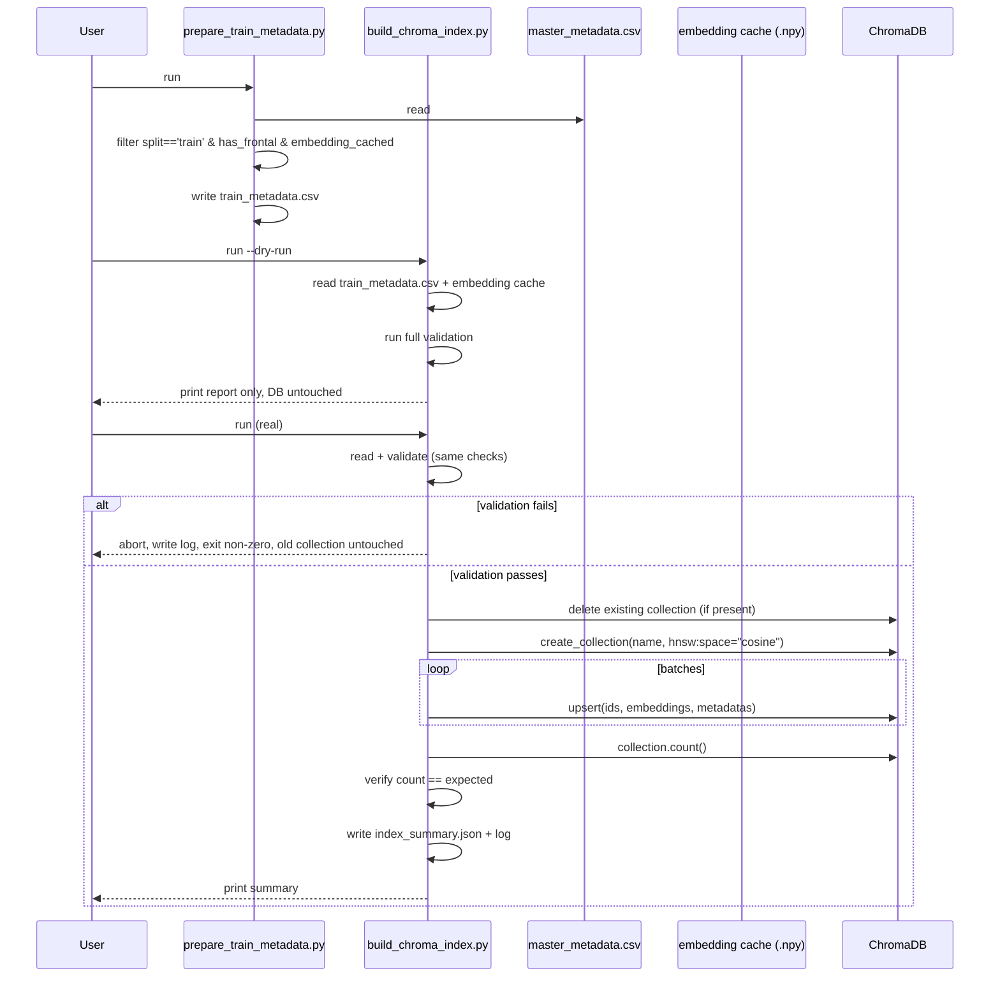
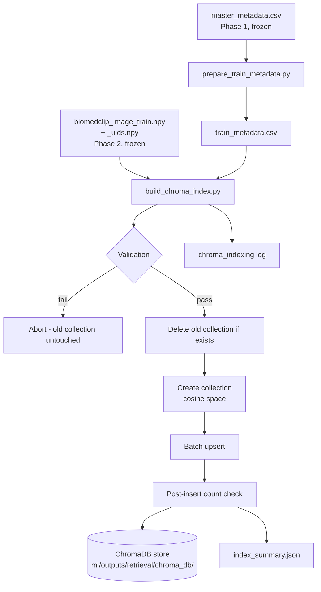
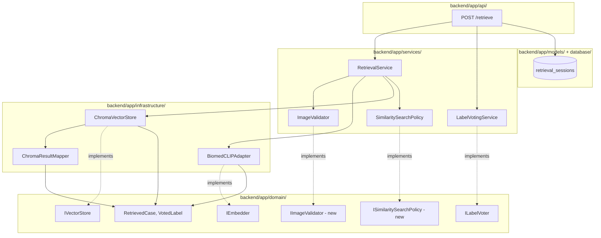
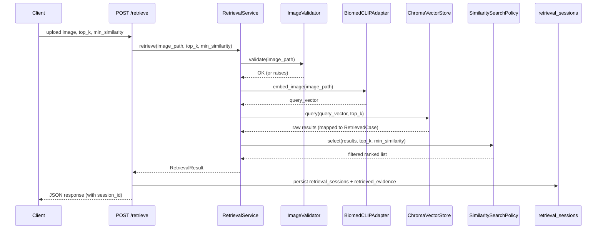

# Development Log

Chronological record of what was built, why, and how it was validated.
Intended as raw material for the thesis methodology/implementation chapters —
each entry states the decision, the reasoning, and concrete evidence.

---

## Repository Structure (frozen)

Adopted a clean-architecture layout separating the ML research pipeline from
the production backend, so experiments run independently of the deployed app.

```
ml/            research pipeline (preprocessing, embeddings, retrieval, evaluation)
  config/          YAML run configs
  preprocessing/   dataset prep stage scripts
  evaluation/      encoder bake-off, statistics, manual review tooling
  datasets/        raw/ masked/ metadata/ splits/  (gitignored)
  outputs/         embeddings/ evaluation/ logs/    (gitignored, except small summary CSVs)
backend/       FastAPI app, clean architecture (api/services/domain/infrastructure/models/schemas)
frontend/      Next.js app
docs/          architecture specs, methodology notes, thesis drafts
deployment/    Docker Compose, env templates
```

Rationale: `ml/` and `backend/` never import each other — both wrap BiomedCLIP/
ChromaDB independently. No generic `scripts/`/`utils/` dumping folders.
`ml/datasets/` separates raw vs. masked vs. derived-metadata vs. splits so the
preprocessing pipeline is auditable stage-by-stage. `ml/outputs/` is organized
by artifact purpose (embeddings / evaluation / logs), not by script name.

---

## Phase 0 — Retrieval Validation Gate

**Goal:** determine whether BiomedCLIP's shared image-text embedding space
retrieves clinically relevant historical chest X-ray cases well enough to
justify the whole RAG architecture, before building any backend module on
top of it.

### Dataset audit
- Source: IU/Indiana chest X-ray dataset. `indiana_reports.csv` = 3,851
  unique studies (true study-level table). `indiana_projections.csv` = 7,466
  images (1-4 per study, mostly frontal+lateral pairs).
- Findings text missing on 514 studies (13%); both findings and impression
  missing on 25. De-identification already applied (`XXXX` tokens in text).
- `Problems`/`MeSH` columns contain disease labels already, but as raw
  MTI/MeSH auto-indexing — mixed with anatomy terms (`Lung`, `Spine`, `Aorta`),
  administrative tags (`No Indexing`, `Technical Quality Unsatisfactory`), and
  device/descriptor terms. Not usable as a flat one-hot matrix without curation.

### Label taxonomy (`ml/config/label_mapping.yaml`)
Curated 18 clinically meaningful classes from the raw `Problems` vocabulary:
mapped disease-finding terms to classes (e.g. Opacity/Infiltrate/Consolidation
→ `Lung Opacity`), dropped bare-anatomy/administrative terms, routed
unmapped-but-genuine rare pathology (Sarcoidosis, TB, etc., all n≤7) to
`Other Abnormality`. Fully versioned, auditable, decoupled from code — editing
the taxonomy requires no script changes.

### Study-level, leakage-safe splitting (`ml/preprocessing/make_splits.py`)
- **Near-duplicate audit**: TF-IDF cosine similarity (threshold 0.90) on
  normalized findings+impression text, clustered via connected components.
  **Result: 28.2% of studies (1,064/3,767) live in a near-duplicate cluster**
  (largest cluster = 51 near-identical normal-chest templates). This is the
  empirical justification for cluster-atomic splitting.
- **Cluster-atomic assignment**: every study in a duplicate cluster is
  assigned to the same split, preventing template leakage across train/test.
- **Iterative multi-label stratification** (self-contained, rarest-label-first
  greedy algorithm) ensures every one of the 18 classes appears in all three
  splits, including rare ones (Pneumothorax: 17/4/4 train/val/test).
- Result: train 2,563 / val 609 / test 595 studies.

### Encoder bake-off (`ml/evaluation/run_encoder_eval.py`, `analyze_results.py`)
- Comparison: BiomedCLIP vs. generic OpenCLIP (ViT-B/32) vs. DenseNet121
  (ImageNet-pretrained, zero-shot feature extraction) vs. empirical random
  baseline. Image→image retrieval (fair common denominator — DenseNet/generic
  CLIP can't embed into BiomedCLIP's text space).
- Relevance defined as graded label-overlap between query and retrieved study
  (curated taxonomy above).
- Metrics: Recall@{1,3,5,10}, Precision@K, MRR, nDCG@10, both micro (all
  queries) and macro (per-class then averaged — the Normal-insensitive view,
  since Normal is ~47% of the data and inflates micro metrics).
- **Statistics**: class-stratified, paired bootstrap (n=2000 resamples) on
  the macro-metric differences between encoders — paired because every
  encoder is evaluated on the identical query set, which cancels shared
  query-level variance and gives a correct significance estimate.

**Pre-registered decision gates** (set before seeing results):
- Gate 1: BiomedCLIP macro Recall@5 beats random baseline, bootstrap 95% CI
  excludes zero.
- Gate 2: BiomedCLIP macro Recall@5 AND nDCG@10 beat generic CLIP, CI
  excludes zero.
- Gate 3: per-class wins concentrate on real findings (not just Normal or
  the Other/Support-Devices grab-bags).

**Results (full val set, n=576 queries, KB=2,462 train studies):**

| Comparison | Metric | Δ | 95% CI | Verdict |
|---|---|---|---|---|
| BiomedCLIP vs random | Recall@5 | +0.072 | [0.020, 0.124] | **PASS** |
| BiomedCLIP vs random | nDCG@10 | +0.073 | [0.051, 0.095] | **PASS** |
| BiomedCLIP vs clip_generic | Recall@5 | +0.064 | [-0.007, 0.134] | inconclusive (CI barely includes 0) |
| BiomedCLIP vs clip_generic | nDCG@10 | +0.060 | [0.039, 0.082] | **PASS** |

Gate 1: clean pass. Gate 2: split verdict — nDCG (uses the full graded
ranking) detects a real, statistically confirmed effect; Recall@5 (coarse
binary top-5 hit/miss) trends positive but is underpowered at this sample
size to confirm it. Gate 3: BiomedCLIP beat random on 11/15 real-finding
classes; standout win on Pleural Effusion (0.889 vs. 0.444–0.511 for the
other encoders); notable weak spot on Degenerative/Bone (a heterogeneous
class) — documented as a limitation, not hidden.

**Decision: BiomedCLIP adopted as the frozen encoder.** Basis: Gate 1 pass +
Gate 2 partial pass (nDCG) + clinically coherent per-class wins, reported
honestly including the inconclusive Recall@5 comparison rather than rounding
up to a clean sweep.

### Manual clinical relevance validation
The label-overlap relevance proxy was checked against independent judgment:
180 query/retrieved pairs (36 queries × top-5 BiomedCLIP neighbors, stratified
across classes) were read and rated 0/1/2 for genuine clinical relevance
(reading `findings`/`impression` text directly, not the label metadata).

**Result: proxy precision 89%, proxy recall 49%** (of pairs manually judged
relevant, the label-overlap proxy caught only about half). Interpretation:
the label-overlap proxy is a **conservative lower bound** on true clinical
relevance — when it says "relevant" it's almost always right, but it misses
roughly half of genuinely relevant retrievals because clinically related
findings sometimes fall into different curated label buckets. This means the
Phase 0 quantitative retrieval metrics likely *understate* BiomedCLIP's true
clinical retrieval quality, which strengthens rather than weakens the case
for adopting it.

*(Methodological note: an initial LLM-assisted first-pass rating was
attempted with a keyword/negation heuristic script; it only reached 67%
agreement with hand-read judgments on a calibration sample and was discarded
in favor of direct reading of all 180 pairs.)*

### How to Write This in Your Thesis (Phase 0 / Encoder Selection)

*Methodology chapter, "Retrieval Validation Experiment" subsection:*

> Before committing to BiomedCLIP as the multimodal encoder, a pre-registered
> retrieval validation experiment was conducted to test whether it retrieves
> clinically relevant historical cases significantly better than alternative
> encoders. Four encoders were compared under an identical image-to-image
> retrieval protocol — BiomedCLIP, a generic ImageNet/LAION-pretrained CLIP
> (ViT-B/32), a zero-shot DenseNet121 feature extractor, and an empirical
> random-retrieval baseline — using a knowledge base built exclusively from
> the training split (2,462 studies) queried against the held-out validation
> split (576 studies), preventing any data leakage into the evaluation.
> Relevance was defined via graded label overlap between query and retrieved
> study, using an 18-class taxonomy curated from the dataset's raw MeSH/MTI
> annotations. Three decision gates were pre-registered before results were
> observed: (1) BiomedCLIP must significantly exceed the random baseline on
> macro-averaged Recall@5, (2) BiomedCLIP must significantly exceed the
> generic CLIP baseline on macro Recall@5 and nDCG@10, and (3) performance
> gains must concentrate on genuine clinical findings rather than the Normal
> or non-specific classes. Statistical significance was assessed via a
> class-stratified, paired bootstrap procedure (2,000 resamples), paired
> because all encoders were evaluated on an identical query set. BiomedCLIP
> passed Gate 1 decisively (Recall@5 Δ = +0.072, 95% CI [0.020, 0.124];
> nDCG@10 Δ = +0.073, 95% CI [0.051, 0.095]) and passed Gate 2 on nDCG@10
> (Δ = +0.060, 95% CI [0.039, 0.082]) but not conclusively on Recall@5
> (Δ = +0.064, 95% CI [-0.007, 0.134]), which we attribute to Recall@5's
> coarser binary signal being underpowered at this sample size relative to
> the graded nDCG metric. Gate 3 was satisfied qualitatively: BiomedCLIP
> outperformed the random baseline on 11 of 15 clinically meaningful finding
> classes, with a pronounced advantage on Pleural Effusion (0.889 vs.
> 0.444–0.511 for competing encoders). On this basis, BiomedCLIP was adopted
> as the frozen encoder for the remainder of the system.

*Why this is a strong paragraph for your defense*: it reports the
inconclusive Recall@5 result honestly instead of rounding up to a clean
sweep, which is exactly the kind of transparency an examiner respects and
will not be able to catch you overclaiming on.

*What to include as a table/figure*: the `ml/outputs/evaluation/
gate_decision_table.csv` and `encoder_comparison_macro.csv` as your primary
results table — this is your strongest, most citable result in the whole
project.


### Report cleaning (`ml/preprocessing/clean_reports.py`)
Normalizes raw findings/impression text for downstream embedding/LLM use:
collapses `XXXX...` de-identification tokens to `[REDACTED]`, strips
whitespace/punctuation artifacts. Flags the 514 impression-only studies
(kept in the retrieval KB, excluded from generation-quality evaluation
targets per the frozen protocol, since findings is the primary generation
target).

---

## Repository restructuring — migration verified

Moved all Phase 0 artifacts from the flat `scripts/`/`config/`/`outputs/`
layout into the frozen `ml/` structure (see top of this log). Verification:
re-ran `build_study_index.py` → `clean_reports.py` → `make_splits.py` against
the relocated files and confirmed byte-for-byte identical results to the
pre-migration run (3,851 studies; 28.2% near-duplicate contamination;
train/val/test = 2,563/609/595; identical per-class distribution). Confirms
the migration was lossless and the path-corrected scripts are functioning
correctly in the new locations (`study_index.csv`/`study_index_clean.csv` →
`ml/datasets/metadata/`, `splits.csv`/`neardup_clusters.csv` →
`ml/datasets/splits/`).

---

## PHI Masking (`ml/preprocessing/phi_masking.py`)

**Pipeline**: uploaded image → OCR text detection → mask detected regions
(padded black box) → downstream BiomedCLIP embedding.

**Design decisions and rationale:**
- **EasyOCR over PaddleOCR**: PaddleOCR would add a second deep-learning
  framework (PaddlePaddle) alongside the existing PyTorch/BiomedCLIP stack,
  duplicating the exact kind of dependency risk already hit once with
  `transformers` for BiomedCLIP's text tower. EasyOCR is PyTorch-native,
  shares the existing CUDA environment, and is not meaningfully less accurate
  for short high-contrast burned-in text (vs. PaddleOCR's advantage on dense
  multi-line documents, which isn't this use case). Tesseract was ruled out
  as weakest on rotated/low-contrast radiographic text.
- **Solid black-box masking over Gaussian blur or inpainting**: inpainting
  hallucinates plausible pixel content to fill the region, which conflicts
  with the project's own evidence-grounding premise (invented texture would
  be a strange thing for an "evidence-grounded" retrieval system to feed its
  encoder). A solid box is an unambiguous null signal and simplest to defend.
- **Confidence threshold (0.30) + padding (6px)**: guards against masking
  false-positive OCR hits on lung texture, and avoids a razor-sharp box edge
  exactly on a text boundary reading as a spurious high-contrast feature to
  a ViT's patch embeddings.
- **No forced masking**: if OCR finds nothing above threshold, the image
  passes through unmodified rather than being run through a no-op mask step.

**Validation approach**: `validate_masking_impact.py` embeds a sample of
images before/after masking with the frozen BiomedCLIP encoder and reports
cosine similarity between the pairs (reuses `embed_images()` from
`run_encoder_eval.py`). High similarity confirms masking stayed confined to
peripheral/non-diagnostic regions; a low-similarity outlier flags a mask that
likely overlapped anatomy, for manual inspection.

**Results (full run, all 3,689 frontal images, RTX 4070 Ti SUPER):**
- 2,875/3,689 images (77.9%) had ≥1 region detected and masked; 4,278 total
  regions; mean processing time 0.426s/image.
- Embedding-impact validation (n=50 sample): mean cosine similarity 0.9916,
  min 0.9215, max 1.0000, **0/50 flagged below the 0.90 threshold** —
  confirms masking did not meaningfully perturb BiomedCLIP's representation
  of any sampled image.

**Reproducibility logging**: `ml/outputs/logs/phi_masking_log.csv` records
per-image `image_id, num_regions_detected, confidence_scores, masking_applied,
processing_time_sec` for debugging/reproducibility. A parallel JSONL log
(`phi_masking_log.jsonl`) retains full per-region box geometry for exact mask
reproduction. Neither log feeds back into the masking pipeline itself.

**Known limitation, stated explicitly rather than glossed over**: IU X-ray's
report text is already de-identified; there is no known burned-in-PHI image
subset in this dataset to measure true detection recall/precision against.
This module is implemented as a deployment-readiness / privacy-by-design
contribution and validated for embedding-impact safety, but is **not**
empirically validated for PHI-detection accuracy on real de-identification
cases. State this distinction clearly in the thesis methodology section —
do not present detection counts on this dataset as a recall measurement.

### How to Write This in Your Thesis

*Methodology chapter, "Privacy Protection" subsection — adapt directly:*

> To support deployment in real clinical settings where chest X-ray images
> may carry burned-in Protected Health Information (patient name, hospital
> identifiers, acquisition dates), a PHI masking stage was implemented prior
> to embedding generation. The stage uses EasyOCR for burned-in text
> detection, chosen over alternatives such as PaddleOCR for framework
> compatibility with the existing PyTorch-based encoder pipeline, avoiding a
> second deep-learning dependency stack. Detected text regions above a
> confidence threshold of 0.30 are masked with a padded solid black box
> rather than Gaussian blur or generative inpainting; the latter was
> deliberately avoided as it would introduce hallucinated pixel content into
> a system whose core design principle is evidence grounding. Across the
> full frontal-image set (3,689 images), 77.9% had at least one region
> detected and masked (4,278 regions total; mean processing time 0.43s per
> image on an RTX 4070 Ti SUPER). To verify masking does not compromise
> diagnostically relevant image content, a validation step compared
> BiomedCLIP embeddings of a 50-image sample before and after masking via
> cosine similarity, yielding a mean similarity of 0.992 (min 0.922, max
> 1.000), with zero images falling below a 0.90 similarity threshold —
> confirming masked regions are confined to non-diagnostic peripheral areas
> and do not materially perturb the encoder's representation. Because the
> dataset used in this study (IU/Indiana chest X-ray) is already de-identified
> at the report level, this module could not be empirically validated for
> PHI-detection recall on real burned-in identifiers; it is presented as a
> deployment-readiness contribution and privacy-by-design measure, with its
> safety (non-interference with diagnostic content) validated rather than
> its detection accuracy.

*Limitations chapter — adapt directly:*

> The PHI masking module's detection accuracy could not be quantitatively
> evaluated, as the dataset used in this study contains no ground-truth
> examples of burned-in PHI. Future work involving hospital-sourced or
> synthetically augmented data would allow formal precision/recall
> measurement of the OCR-based detection stage.

*What to screenshot/include as a figure*: a before/after masked-image pair
from `ml/datasets/masked/` alongside the original in `ml/datasets/raw/`, and
the `validate_masking_impact.py` similarity-distribution output (mean/min/max
cosine similarity) as a small results table.


### Master Metadata (`ml/preprocessing/build_master_metadata.py`)

**Purpose**: single canonical study-level file consolidating every Phase 1
artifact (`study_index`, `study_index_clean`, `splits`, `phi_masking_log`,
`projections`) into one source of truth — `ml/datasets/metadata/
master_metadata.csv`. Every downstream module (embedding, retrieval,
evaluation, backend ingestion, future longitudinal history) reads from this
file; no module re-joins the underlying artifacts itself.

**Schema** (one row per study): `study_uid`, `patient_uid` (synthetic,
`SYN-{uid}`, 1:1 for now — real patient linkage does not exist in this
dataset; see Fork C), `image_ids`, `projections_available`, `num_images`,
`has_frontal`, `frontal_filename`, `raw_image_path`, `masked_image_path`,
`phi_masking_applied`, `phi_regions_detected`, `primary_label`, `label_set`,
18 binary class columns, `findings_clean`, `impression_clean`,
`has_findings`, `full_text`, `split`, `cluster_id`, `exclude_flag`,
`embedding_model`, `embedding_version`, `embedding_cached`,
`processing_stage`, `pipeline_version`, `created_at`, `updated_at`.

**Design decision — computed vs. tracked state**: fields describing *live
operational status* (`embedding_cached`, `processing_stage`) are computed
from filesystem-observable evidence every time the file is regenerated
(does the `.npy` cache exist? does the masked file exist?) rather than
manually set and persisted. This was a deliberate correction from an earlier
proposal to include `indexed_in_chromadb`/`embedding_status` as flat CSV
flags — those genuinely live operational states belong in the backend's
PostgreSQL tables (once built), where they can be updated transactionally as
async pipeline stages complete; a batch-generated CSV cannot safely hold
state that a live process also mutates without risking drift between the
two. `created_at` is preserved across regenerations (merged against the
prior file if one exists); `updated_at` refreshes every run — this makes the
file idempotent and safe to re-run at any pipeline stage.

**Validation**: tested against synthetic fixtures covering every edge case
(a study with no frontal image, a study with a declared-but-missing frontal
file, partial masking coverage, partial embedding-cache coverage) before
running on real data; all computed fields matched hand-calculated
expectations exactly. One bug caught during testing and fixed:
`masked_image_path` was initially populating from `frontal_filename`
presence alone rather than actual masked-file existence — corrected to only
populate when the file is verified on disk.

**Results (full dataset, 3,851 studies):**
- `processing_stage`: 3,689 `Masked`, 162 `Missing` (matches the no-frontal
  count exactly).
- `embedding_cached`: 0/3,851 (expected — the embedding cache was deleted
  during the earlier restructuring mishap and has not yet been regenerated;
  will populate once Phase 2 embedding runs).
- `phi_masking_applied`: 2,875 (matches the PHI masking module's run
  exactly).

### How to Write This in Your Thesis

*Methodology chapter, "Data Pipeline / Canonical Metadata" subsection:*

> To ensure every downstream component of the system operates on a single,
> consistent view of the dataset, all preprocessing artifacts — the curated
> disease taxonomy labels, cleaned report text, leakage-safe split
> assignments, and PHI masking outcomes — were consolidated into one
> canonical study-level metadata file. Fields describing transient pipeline
> state (whether an embedding is cached, the current processing stage of a
> study) are computed from filesystem-observable evidence at generation
> time rather than manually tracked, since a statically generated file
> cannot safely represent live operational state that a concurrently running
> system might also mutate; such state is deferred to the relational
> database layer in the production backend. This design keeps the metadata
> file idempotent and reproducible: regenerating it at any point in the
> pipeline yields a file that accurately reflects current on-disk state
> without risk of drift.

---

## Phase 1 (Dataset Foundation) — COMPLETE

All items delivered and validated on the real dataset: label taxonomy,
study-level organization, leakage-safe train/val/test split, report
cleaning, PHI masking (with embedding-impact validation), and canonical
master metadata consolidation. Proceeding to Phase 2 (Embedding Pipeline).


## Open items carried forward
- Backend domain layer (`backend/app/domain/entities.py`, `interfaces.py`)
  scaffolded and unit-verified (pure Python, no framework deps) but not yet
  wired to infrastructure -- deferred until Phase 2 (embedding pipeline) and
  Phase 3 (retrieval pipeline) are validated, per the agreed data-pipeline-
  first development order.

---

## Phase 2 — Embedding Pipeline

### Shared Embedding Wrapper (`shared/embeddings/`)

**Design decision — introducing `shared/` as a top-level package.** The
frozen architecture originally specified `ml/` and `backend/` never import
each other, so research stays independent of the deployed app. This module
is a deliberate, justified exception: both the offline embedding pipeline
and the backend's live embedding service must produce vectors in the
identical latent space, or retrieval breaks silently (a subtle preprocessing
or normalization difference between two independent implementations would
not raise an error -- it would just quietly degrade retrieval quality).
`shared/embeddings/` is therefore a genuine shared kernel, not a generic
dumping folder, consistent with the "flag it if a real cross-cutting need
appears" caveat established when `shared/` was originally deferred.

**Structure:**
```
shared/embeddings/
├── base.py                  # BaseEmbedder ABC + l2_normalize() helper
└── biomedclip_embedder.py   # BiomedCLIPEmbedder(BaseEmbedder) -- the frozen production embedder
```

**`BaseEmbedder` (ABC)**: every embedder implements only `embed_images()` and
`embed_texts()` (batched); the singular convenience methods (`embed_image`,
`embed_text`) are implemented once on the base class and inherited by every
subclass, rather than re-implemented per model. This ABC does not exist to
satisfy the backend's `IEmbedder` Protocol -- Python Protocols are
structural, so `BiomedCLIPEmbedder` already satisfies `IEmbedder` without
inheriting from it. The ABC's job is purely internal consistency within
`shared/embeddings/` as it grows to potentially support additional models
(MedCLIP, BioViL, CheXzero) in the future.

**`BiomedCLIPEmbedder`**: loads the frozen BiomedCLIP model once in
`__init__` (vision tower, PubMedBERT text tower, preprocessing transform),
reused across all calls. All outputs L2-normalized so any caller can take a
dot product for cosine similarity without remembering to normalize. torch/
open_clip are imported lazily inside `__init__`, not at module level, so the
module (and its pure helper functions) remain importable in environments
without a GPU.

**Validation:**
- ABC contract tested with a fake subclass: confirmed `BaseEmbedder` blocks
  direct instantiation, and `embed_image`/`embed_text` correctly delegate to
  the batched methods.
- `l2_normalize()` tested including the zero-vector edge case (stays zero,
  no NaN propagation).
- Device resolution (`auto` → cuda/cpu, explicit override) tested with a
  fake torch stand-in.
- End-to-end smoke test on the real workstation (RTX 4070 Ti SUPER, real
  IU X-ray image via `master_metadata.csv`): 512-dim embeddings for both
  image and text, norm = 0.999999918 (correctly unit-length).

#### How to Write This in Your Thesis (Shared Embedding Wrapper)

*Methodology chapter, "Embedding Pipeline" subsection:*

> A single embedding interface, `BiomedCLIPEmbedder`, was implemented as a
> shared component consumed identically by the offline embedding-generation
> pipeline and the production backend's embedding service. This design
> choice guarantees that knowledge-base embeddings computed offline and
> query embeddings computed at inference time occupy an identical vector
> space; maintaining two independent implementations was deliberately
> avoided, as a subtle divergence between them (differing preprocessing or
> normalization) would degrade retrieval quality without raising any error,
> making such a bug difficult to detect. The interface follows an abstract
> base class exposing batched image and text embedding methods, with
> singular convenience methods derived once at the base-class level so that
> any future embedder implementation need only implement the batched
> methods to gain full interface conformance. All returned embeddings are
> L2-normalized, allowing every downstream consumer to compute cosine
> similarity via a simple dot product.

### Batch Embedding Generation (`ml/embeddings/generate_embeddings.py`)

**Purpose**: thin orchestrator built on `shared/embeddings/`. Reads
`master_metadata.csv`, embeds every study's masked frontal image and report
text via `BiomedCLIPEmbedder`, caches outputs with explicit uid alignment.

**Design decisions:**
- Embeds from `masked_image_path`, not raw — PHI masking is validated and
  complete, so production embeddings should be computed from
  privacy-protected images. Falls back to raw with a printed warning if a
  masked file is unexpectedly missing.
- Explicit `_uids.npy` companion array alongside every embedding cache file,
  so any consumer (ChromaDB indexing, backend) aligns by uid directly rather
  than re-deriving the same filter/sort logic that produced the cache —
  this superseded and replaced Phase 0's narrower, order-implicit cache
  convention (`biomedclip_train.npy` etc., image-only, train+val only).
- Skip-if-cached logic (checks `_uids.npy` length matches expected count)
  makes re-runs fast and idempotent.
- Computing embeddings for all three splits does not violate the "touch
  test once" leakage protocol — that applies to KB construction (train-only)
  and final evaluation, both later steps; raw embedding computation is a
  representation, not an evaluation look.

**Bug caught and fixed during implementation**: the `--limit` dry-run flag
used the same `groupby().apply()` pattern that silently drops the grouping
column on pandas ≥2.2/3.0 (identical root cause to the bug hit earlier in
`analyze_results.py`'s manual-review sampling) — `split` disappeared from
the limited dataframe, crashing every downstream filter. Fixed with the same
explicit per-group-loop pattern used previously. Verified against the
team's actual pandas 3.0.2 install before re-shipping.

**Modified file**: `ml/preprocessing/build_master_metadata.py` — the
`embedding_cached` computed field was updated to check the new
`biomedclip_image_{split}_uids.npy` files (exact uid membership) instead of
the old row-count-guess against the Phase 0 scratch cache filename
convention, since the two conventions no longer matched. Added explicit
per-path debug printing (`checking embedding cache: {path} exists={bool}`)
after a stale-script confusion during testing, so any future path/version
mismatch is immediately visible in the script's own output rather than
silently producing `embedding_cached: 0`.

**Results (full run, all 3,851 studies, RTX 4070 Ti SUPER):**

| Split | Images embedded | Time | Text embedded | Time |
|---|---|---|---|---|
| train | 2,462 | 167.4s (0.068s/img) | 2,557 | 6.5s |
| val | 576 | 39.4s (0.068s/img) | 599 | 1.5s |
| test | 571 | 38.8s (0.068s/img) | 586 | 1.5s |

Total: 7,351 embeddings, 255.2s (~4.3 minutes). Image counts (2,462+576+571
= 3,609) are lower than the 3,689 total frontal-image count because the 84
technical-quality-flagged studies excluded before splitting (per the
leakage-safe splitting protocol) have no `split` assignment and are
correctly skipped — confirmed via `master_metadata.csv` refresh:
`embedding_cached: 3,609/3,851`, `processing_stage`: 3,609 `Embedded`, 80
`Masked` (the flagged studies), 162 `Missing` (no frontal).

### How to Write This in Your Thesis

*Methodology chapter, "Embedding Generation" subsection:*

> Image and text embeddings were generated for all 3,609 non-flagged
> studies with an available frontal view (2,462 train / 576 validation /
> 571 test), plus corresponding report-text embeddings, using the frozen
> BiomedCLIP encoder via the shared embedding interface. Embedding
> generation operated on PHI-masked images rather than raw images,
> consistent with the project's privacy-by-design approach. The full
> generation run completed in approximately 4.3 minutes on a consumer GPU
> (RTX 4070 Ti SUPER), averaging 0.068 seconds per image and under 0.01
> seconds per text embedding — a runtime profile consistent with the
> project's low-resource deployment goals. Each cached embedding array is
> stored alongside an explicit study-identifier array to guarantee
> alignment for downstream consumers, avoiding implicit ordering
> assumptions between the embedding cache and the source metadata.

### Embedding Validation (`ml/embeddings/validate_embeddings.py`)

Three post-hoc sanity checks on the real cached embeddings, distinct from
Phase 0's encoder bake-off (which already validated BiomedCLIP as the
correct encoder choice). This asks a narrower question: did *this*
production run produce healthy, correctly-aligned vectors?

**Results (real run, train split, seed=42):**

**Check 1 — array health**: all 6 cached arrays (image/text × train/val/test,
7,271 total vectors) fully finite, zero degenerate zero-vectors, perfect
unit norm (mean=1.0, std=0.0). Definitive confirmation the generation
pipeline executed correctly.

**Check 2 — near-duplicate cluster cohesion**: within-cluster mean
similarity 0.9131 vs. random-pair mean similarity 0.8831 (gap = 0.030,
n=7,284 within-cluster pairs). Direction is correct (near-duplicate images
score higher) but the gap is smaller than an initial heuristic threshold
suggested, because baseline similarity between *any* two chest X-rays is
already high (~0.88) — a known property of medical image embeddings, where
shared modality/framing dominates over diagnostic content unless the
encoder is fine-tuned for fine-grained separation. This is not a pipeline
defect; it is a property of the embedding space worth stating honestly
rather than glossing over with an inflated pass/fail threshold.

**Check 3 — image→text batch retrieval accuracy**: top-1 = 4.8% (vs. 2.0%
random baseline, ~2.4×), top-5 = 15.6% (vs. 10.0% random, ~1.56×). A real
but modest cross-modal signal. Two plausible contributing factors: (1)
BiomedCLIP was pretrained on short PubMed figure captions, a different text
distribution than the long-form clinical findings+impression narratives
used here — a genuine domain-mismatch limitation worth documenting; (2) the
28.2% near-duplicate report rate established in Phase 0 makes exact
self-uid matching an unfairly strict metric, since an image can correctly
match a text that is functionally identical to its true pair but attributed
to a different study uid and still be scored as a miss.

**Why this does not threaten the system**: the frozen production retrieval
mechanism is **image→image** (validated thoroughly in Phase 0's Gate 1/2/3),
not image→text embedding matching. Text embeddings exist for potential
future capabilities (e.g., a symptom-text search feature), not the core
retrieval path. Check 3's modest result is a genuine, citable limitation of
the embedding space's cross-modal alignment — not a defect in the
implemented retrieval pipeline.

### How to Write This in Your Thesis

*Methodology chapter, "Embedding Validation" subsection:*

> The generated embeddings were validated with three post-hoc checks beyond
> the encoder-selection validation performed in Phase 0. All cached
> embedding arrays passed a numerical health check (no non-finite values,
> no degenerate zero vectors, correct unit normalization across all 7,271
> vectors), confirming the generation pipeline executed without corruption.
> A near-duplicate cohesion check, leveraging the template-duplicate
> clusters identified during dataset splitting, confirmed that near-
> identical images receive measurably higher cosine similarity (0.913) than
> random image pairs (0.883); the modest size of this gap reflects the high
> baseline visual similarity shared by all chest radiographs regardless of
> diagnostic content, a known characteristic of medical image embedding
> spaces, rather than a deficiency in the pipeline. A cross-modal batch
> retrieval check found that BiomedCLIP's image and text embeddings for the
> same study exhibit alignment modestly above chance (top-1 accuracy 4.8%
> against a 2.0% random baseline), which we attribute to a distributional
> mismatch between BiomedCLIP's caption-style pretraining data and the
> long-form clinical narratives used in this study, compounded by the
> dataset's substantial template-duplication rate. As the system's
> retrieval mechanism operates on image-to-image similarity rather than
> cross-modal matching, this limitation does not affect the implemented
> retrieval pipeline, but is noted as a boundary of the embedding space's
> capabilities for any future text-query features.

*Limitations chapter — adapt directly:*

> Cross-modal (image-to-text) alignment of the generated BiomedCLIP
> embeddings was found to be only modestly above chance when evaluated via
> batch retrieval accuracy, likely reflecting a mismatch between
> BiomedCLIP's pretraining distribution (short image captions) and the
> long-form clinical report text used in this study. This does not affect
> the system's core retrieval mechanism, which relies on image-to-image
> similarity, but would need to be addressed (e.g., via report-text
> summarization to a caption-like form, or a different text encoder) before
> any future feature relying on direct text-to-image search.

---

## Phase 2 (Embedding Pipeline) — COMPLETE

Shared `BiomedCLIPEmbedder` wrapper, batch generation across all splits, and
three-part post-hoc validation all delivered and verified on real data.
Array integrity confirmed definitively; near-duplicate cohesion and
cross-modal alignment characterized honestly, with findings that inform but
do not block the frozen image-to-image retrieval design. Proceeding to
Phase 3 (Retrieval Pipeline / ChromaDB indexing).

---

## Phase 3 — Retrieval Pipeline: Architecture (FROZEN)

**Status: approved and frozen.** Not to be redesigned without a critical
correctness issue.

### Corrections made to the initial proposal before freezing

1. **No new `SplitManager` module.** `master_metadata.csv` (Phase 1, frozen)
   already carries the `split` column. Introducing a split-decision module
   would mean re-touching frozen Phase 1 output. Instead: a new,
   Phase-3-owned `prepare_train_metadata.py` filters the existing frozen
   file — satisfies single-responsibility (the Indexer never decides split
   membership) without redesigning anything upstream.
2. **`image_path` in ChromaDB metadata must be the masked path, not raw.**
   Phase 2 embeddings were computed from `masked_image_path`. Pointing
   metadata at raw images would mean any future explainability feature
   displays a different image than the one actually embedded — a silent
   correctness bug.
3. **`indexed_at` is a distinct field from `master_metadata`'s own
   `created_at`** — the former is when a record enters ChromaDB, the latter
   is when the study record was first generated; conflating them loses
   information.

### Architecture

```
master_metadata.csv (Phase 1, frozen)
        |
        v
prepare_train_metadata.py   [NEW, Phase 3]
        |  filters: split=='train' AND has_frontal AND embedding_cached
        v
train_metadata.csv
        |
        |         biomedclip_image_train.npy
        |         biomedclip_image_train_uids.npy   (Phase 2, frozen)
        |                    |
        v                    v
        build_chroma_index.py   [NEW, Phase 3]
                    |
                    v
              Validation gate (hard-fail, DB untouched if fail)
                    |
                    v
         Delete old collection -> Create new (cosine space) -> Batch upsert
                    |
                    v
         Persistent ChromaDB collection + index_summary.json + log
```

### Module responsibilities

| Module | Responsibility | Must NOT do |
|---|---|---|
| `prepare_train_metadata.py` | Read `master_metadata.csv`, filter to indexable train rows, write `train_metadata.csv` | Touch embeddings, touch ChromaDB, decide split logic |
| `build_chroma_index.py` | Load `train_metadata.csv` + embedding cache, validate, create/populate collection, write summary + log | Generate embeddings, re-derive split membership, proceed past a validation failure |

### Folder structure

```
ml/retrieval/
├── prepare_train_metadata.py
└── build_chroma_index.py

ml/datasets/metadata/
└── train_metadata.csv            # derived, same home as other *_metadata.csv files

ml/outputs/retrieval/
├── chroma_db/                    # ChromaDB persistent store (gitignored)
└── index_summary.json

ml/outputs/logs/
└── chroma_indexing_{timestamp}.log
```

**`.gitignore` addition required**: `ml/outputs/retrieval/chroma_db/` (large, regeneratable binary store).

### ChromaDB metadata schema

| Field | Source | Notes |
|---|---|---|
| `study_uid` | `master_metadata.study_uid` | Chroma document ID |
| `patient_uid` | `master_metadata.patient_uid` | synthetic; future longitudinal-demo linkage |
| `image_path` | `master_metadata.masked_image_path` | masked, matches what was embedded |
| `projection` | fixed `"Frontal"` | frontal-only per frozen decision |
| `primary_label` | `master_metadata.primary_label` | |
| `label_set` | `master_metadata.label_set` | semicolon-joined |
| `is_normal` | computed | cheap boolean filter |
| `findings` | `master_metadata.findings_clean` | direct explainability use, no second join |
| `impression` | `master_metadata.impression_clean` | |
| `dataset` | fixed `"IU_XRay"` | supports future multi-dataset collections |
| `embedding_model` | `master_metadata.embedding_model` | `"biomedclip"` |
| `embedding_version` | `master_metadata.embedding_version` | `"v1"` |
| `split` | fixed `"train"` | defense-in-depth, redundant with collection name |
| `cluster_id` | `master_metadata.cluster_id` | near-dup diagnostic at retrieval time |
| `indexed_at` | generated at index time | distinct from metadata's `created_at` |

### Collection naming

`{dataset}_{embedding_model}_{embedding_version}_{split}` -> e.g.
`iu_cxr_biomedclip_v1_train`. Must satisfy ChromaDB's real naming
constraints (alphanumeric/underscore/hyphen, start/end alphanumeric,
3-63 chars) -- a hard runtime error if violated, not a style preference.

### Validation strategy (hard-fail, checked before any DB mutation)

- Every row has `split == 'train'` (defense-in-depth leakage guard)
- Set-equality between metadata uids and embedding-cache uids (exact
  mismatch list on failure, not just a count)
- No duplicate `study_uid`
- No missing/null `masked_image_path`, `primary_label`, `study_uid`
- Embedding array: correct dimension (512), all finite, unit-norm, zero
  degenerate vectors (re-running Phase 2's health check at index time)
- Collection name passes naming-constraint check
- Post-insertion: `collection.count()` exactly equals validated input count

### Index summary (`index_summary.json`)

Fields: `collection_name`, `dataset`, `embedding_model`, `embedding_version`,
`pipeline_version`, `split`, `source_row_count`, `num_indexed`,
`failed_records`, `duplicate_count`, `embedding_dimension`,
`class_distribution`, `distinct_neardup_clusters_represented`,
`validation_passed`, `warnings`, `execution_time_sec`, `timestamp`.

### Sequence diagram



### Architecture diagram



### Key implementation decisions carried into code

- Validate entirely in-memory **before** deleting the old collection (a
  mid-run failure must never leave zero working collections).
- `--dry-run` flag: runs every validation check, prints would-be summary,
  never touches ChromaDB.
- Explicit `hnsw:space: "cosine"` on collection creation -- ChromaDB
  defaults to L2 otherwise; for unit-normalized vectors L2 and cosine
  produce identical rankings mathematically, but leaving this implicit is a
  classic RAG bug source if normalization assumptions ever change.
  Stated explicitly, not left implicit.
- Local `PersistentClient` (embedded, file-backed) -- no separate DB server
  process, appropriate for a local thesis deployment.
- Whole pipeline safely re-runnable end to end (idempotent), consistent
  with every prior module.

### Implementation & Validation

**`prepare_train_metadata.py`** (`ml/retrieval/`): tested against synthetic
fixtures covering every filter branch (not-train, no-frontal, no-cached-
embedding) and a missing-masked-path edge case (correctly triggers a
warning). Real run: 3,851 source rows -> 2,462 filtered (1,288 dropped as
not-train, 101 dropped as no-frontal, 0 dropped for missing embeddings --
confirming Phase 2 completed cleanly).

**`build_chroma_index.py`** (`ml/retrieval/`): all 6 validation checks
individually proven, via a mocked ChromaDB client, to both pass clean data
and correctly catch their target failure (non-train leakage row, uid
mismatch between metadata and embedding cache, duplicate uids, NaN-
corrupted embeddings, wrong embedding dimension, invalid collection name).
Orchestration logic proven against the mock: uid alignment is correct even
when the embedding cache array order differs from the metadata row order
(embeddings and metadata both independently verified to land on the correct
uid); a validation failure leaves a pre-existing collection completely
untouched, confirming the "validate before delete" safety property holds in
practice, not just in the sequence diagram.

Real ChromaDB installation was not testable in the development sandbox (no
network access); the mocked-client tests above cover all logic up to the
real `chromadb.PersistentClient` API calls themselves, which were verified
on the actual workstation (see results below).

**Results (real run, RTX 4070 Ti SUPER):**
- Dry run: validation passed, 0 warnings, 0 errors, would index 2,462 records.
- Real run: deleted (no prior collection existed), created, indexed all
  2,462 records in **1.03 seconds**, post-insert `collection.count()`
  verified exact match.
- Post-hoc query test: `collection.count()` = 2,462 confirmed independently;
  sample records returned correct uids, labels, and **masked** image paths
  (not raw), confirming the Correction 2 fix (image_path must be the masked
  path) is functioning correctly in the real index.

**Class distribution indexed** (train split, matches Phase 1's known split
exactly): Normal 918, Other Abnormality 301, Degenerative/Bone 162,
Granuloma 131, Cardiomegaly 110, Support Devices 109,
Calcinosis/Atherosclerosis 100, Atelectasis 97, Scarring 91, Emphysema/COPD
77, Nodule/Mass 70, Pleural Effusion 66, Lung Opacity 61, Edema/Congestion
57, Hernia/Diaphragm 49, Pneumonia 25, Fibrosis/Interstitial 21,
Pneumothorax 17.

### How to Write This in Your Thesis

*Methodology chapter, "Retrieval Index Construction" subsection:*

> The retrieval knowledge base was constructed as a persistent ChromaDB
> collection, built exclusively from the training split's cached image
> embeddings, consistent with the leakage-prevention protocol established
> during dataset splitting. Indexing followed a two-stage pipeline enforcing
> strict separation of responsibilities: a metadata-preparation stage
> filtered the canonical study metadata to the subset of train-split studies
> with both an available frontal image and a successfully cached embedding,
> and a separate indexing stage performed exhaustive validation — checking
> for split-membership leakage, embedding/metadata identifier mismatches,
> duplicate records, missing required fields, and embedding numerical health
> (finite values, correct dimensionality, unit normalization) — entirely
> in-memory before any modification to the persistent database. This
> ordering guarantees that a validation failure never leaves the system
> without a working retrieval index. All 2,462 eligible training studies
> were successfully indexed in 1.03 seconds, with post-insertion record
> counts verified to exactly match the validated input, and a subsequent
> independent query confirmed both correct record counts and correct
> retrieval of privacy-masked (rather than raw) image paths.

---

## Phase 3 core (Retrieval Indexing) — COMPLETE

`prepare_train_metadata.py` and `build_chroma_index.py` both implemented,
tested (mocked-client unit tests + real end-to-end run), and validated on
real data. Persistent, queryable, leakage-safe ChromaDB collection
(`iu_cxr_biomedclip_v1_train`, 2,462 records) confirmed working. Remaining
Phase 3 work: the retrieval query interface (image query -> ChromaDB ->
ranked results), which the backend's future `RetrievalService` will wrap.

---

## Phase 4 — Backend Assembly: Architecture (FROZEN)

**Status: approved and frozen.** Not to be redesigned without a critical
correctness issue. Objective: expose the validated Phase 0-3 ML pipeline
through a clean backend architecture. Must NOT modify preprocessing,
embeddings, ChromaDB indexing, or evaluation -- those are complete.

### Corrections/decisions made before freezing

1. **`SimilaritySearchPolicy` is not a pass-through.** It owns real logic:
   top-K selection + a minimum-similarity threshold cutoff. Near-duplicate
   cluster deduplication (using `cluster_id`, given the known 28.2%
   template-duplication rate from Phase 1) is a documented future
   extension point, not implemented in Phase 4.
2. **`session_id` is generated at the API/DB layer, not inside
   `RetrievalService`.** The service stays session-agnostic and DB-free --
   pure orchestration, trivially unit-testable with fakes.
3. **Only `retrieval_sessions` is built in Phase 4, not the broader
   `sessions` cache table.** The latter has nothing to cache until context
   building and report generation exist; building it now means an
   unexercised table. Deferred to whichever phase introduces report
   generation.
4. **Weighted-voting formula frozen explicitly** (was underspecified since
   Fork A): for each label L among retrieved cases,
   `weight(L) = sum(similarity_i for cases carrying L)`;
   `predicted label = argmax(weight(L))`;
   `agreement = fraction of retrieved cases carrying the predicted label`.
   Maps directly onto the existing `VotedLabel` entity.
5. **PHI masking is not wired into the `/retrieve` upload path in Phase 4.**
   Stated explicitly as a scope boundary, not hidden as an oversight --
   real future work.

### Module dependency diagram



### Retrieval Service interfaces

Two new domain Protocols added to `domain/interfaces.py`:
```
IImageValidator.validate(image_path: str) -> None       # raises ValueError on invalid input
ISimilaritySearchPolicy.select(raw_results, top_k, min_similarity) -> list[RetrievedCase]
```

`RetrievalService` -- pure orchestrator, constructor-injected:
```
__init__(validator: IImageValidator, embedder: IEmbedder,
          vector_store: IVectorStore, search_policy: ISimilaritySearchPolicy)
retrieve(image_path: str, top_k: int = 5, min_similarity: float = 0.0) -> list[RetrievedCase]
```
Sequence: validate -> embed -> `vector_store.query()` -> `search_policy.select()` -> return.
No business logic in the service itself -- if logic accumulates here, it belongs
in a collaborator instead.

### RetrievedCase entity gap (found during implementation, fixed)

The domain entity `RetrievedCase` (scaffolded before Phase 3's metadata
schema existed) was missing `image_path` and `cluster_id` -- both required
by the frozen response contract below, with `image_path` specifically
carrying forward the Phase 3 Correction-2 fix (masked, not raw, path).
Fixed by adding two fields with safe defaults (`image_path: str = ""`,
`cluster_id: int = -1`) so no existing construction site breaks.
`primary_label` was deliberately NOT added as a new field -- by convention,
it is `labels[0]` when `labels` is non-empty, keeping the entity minimal.

### Input/output contracts

**Request** (multipart upload):
```
POST /retrieve
  file: UploadFile (image)
  top_k: int = 5
  min_similarity: float = 0.0
```

**Response:**
```json
{
  "session_id": "uuid",
  "retrieval_time_ms": 124,
  "embedding_model": "biomedclip",
  "embedding_version": "v1",
  "collection_name": "iu_cxr_biomedclip_v1_train",
  "retrieved_cases": [
    {
      "rank": 1, "similarity": 0.95, "study_uid": "...",
      "primary_label": "...", "label_set": "...", "cluster_id": 42,
      "findings": "...", "impression": "...",
      "image_path": "ml/datasets/masked/...png"
    }
  ]
}
```

### Folder structure

```
backend/app/
|-- domain/            entities.py, interfaces.py (existing + Phase 4 additions)
|-- services/           image_validator.py, similarity_search.py,
|                        retrieval_service.py, label_voting_service.py
|-- infrastructure/     biomedclip_adapter.py, chroma_store.py, chroma_result_mapper.py
|-- models/             SQLAlchemy: retrieval_sessions (+ others deferred)
|-- core/config.py      Settings
|-- database/           session factory, Alembic env
|-- api/retrieval.py    POST /retrieve, GET /health
`-- main.py

backend/tests/
|-- unit/          test_retrieval_service.py, test_label_voting_service.py,
|                   test_chroma_result_mapper.py
`-- integration/    test_retrieval_integration.py (real ChromaDB + real embedder)
```

### Database model overview (Phase 4 scope)

| Table | Purpose |
|---|---|
| `retrieval_sessions` | one row per `/retrieve` call |
| `retrieved_evidence` | one row per returned case, FK to session -- audit trail |

`patients`, `studies`, `study_images`, `reports`, broader `sessions` deferred
to the phase introducing report generation.

### Testing strategy

- Unit -- `RetrievalService`: all 4 collaborators faked, assert call order + correct mapping.
- Unit -- `LabelVotingService`: pure function, hand-calculated expected output.
- Unit -- `ChromaResultMapper`: pure function, fake Chroma-shaped input.
- Integration: real `BiomedCLIPAdapter` + real ChromaDB collection + real FastAPI `TestClient`.

### Sequence diagram



### Development order (must complete each step before the next)

1. Interface definitions -> 2. Infrastructure adapters -> 3. RetrievalService
-> 4. Unit tests -> 5. Integration tests -> 6. Freeze RetrievalService ->
7. LabelVotingService -> 8. Freeze LabelVoting -> 9. Database layer ->
10. Alembic migration -> 11. FastAPI skeleton -> 12. Swagger validation.

**Status as of this entry: Step 1 (interfaces) complete and verified in the
development sandbox. `biomedclip_adapter.py` written. Steps 1 (entity fix)
through 5 (integration test) handed to Claude Code for implementation.**

---

## Phase 4 Steps 1–5 — RetrievalService — Implementation & Validation

### Folder setup

`backend/app/{domain,infrastructure,services}/` and
`backend/tests/{unit,integration}/` created with `__init__.py` package
markers. The two files developed in the sandbox — `interfaces.py` and
`biomedclip_adapter.py` — were placed at repo root for handoff and moved
into `backend/app/domain/` and `backend/app/infrastructure/` respectively;
`entities.py` was handed off as pasted content rather than a placed file
and was written directly to `backend/app/domain/entities.py` from that
content.

### Step 1 — `RetrievedCase` entity gap, fixed

Confirmed via grep that `entities.py` did not yet exist anywhere in the
repository before this step (the earlier claim that it had already been
"moved" was not reflected on disk) — written from the handed-off content,
then the gap described in the Phase 4 freeze above was fixed: two fields
added to `RetrievedCase`, both with safe defaults so no existing
construction site breaks:
```python
image_path: str = ""        # masked path (Phase 3 Correction-2), matches what was embedded
cluster_id: int = -1        # near-dup cluster diagnostic; -1 = unset
```
`primary_label` deliberately not added as a field, per the frozen decision
— recovered as `labels[0]` by convention. Verified: `RetrievedCase`
instantiates correctly both with and without the new fields, and
`domain/interfaces.py` imports cleanly against the updated entity.

### Step 2 — Infrastructure adapters

**`chroma_result_mapper.py`**: pure function, `raw_result -> list[RetrievedCase]`.
Before trusting the distance→similarity conversion, queried the real
`iu_cxr_biomedclip_v1_train` collection with an embedding taken directly
from a stored record — self-query returned `distance == 0.0` for that
record, confirming Chroma's `hnsw:space="cosine"` returns **cosine
distance**, not similarity, so the mapper uses `similarity = 1.0 -
distance`. Verified once more on a hand-built input (`distance=0.0 ->
similarity=1.0`, `distance=0.25 -> similarity=0.75`) before writing
`chroma_store.py` on top of it.

**`chroma_store.py`**: implements `IVectorStore`, wraps
`chromadb.PersistentClient` pointed at `ml/outputs/retrieval/chroma_db`,
collection name defaults to `iu_cxr_biomedclip_v1_train` (constructor
parameter, not hardcoded). `query()` verified end-to-end against the real
collection: self-query similarity was exactly `1.0`, and the top-3 results
returned real masked image paths, correct `cluster_id`, and correct
`primary_label`.

*Environment note:* `chromadb` was not previously installed (Phase 0's
`requirements.txt` had it commented out as backend-only); installed
`chromadb>=0.4` and uncommitted the requirement, since Phase 3/4 now
depend on it directly.

### Step 3 — `RetrievalService` and collaborators

`image_validator.py` (file exists, non-empty, openable via Pillow),
`similarity_search.py` (threshold filter + top-K by similarity descending,
near-dup dedup left as a documented future extension per the freeze), and
`retrieval_service.py` (pure orchestrator, no business logic) all written
per spec. Smoke-tested inline before the formal test suite: validator
correctly accepted a real masked image and correctly raised `ValueError`
on a missing file; `SimilaritySearchPolicy.select()` correctly filtered
and ranked a synthetic input; `RetrievalService.retrieve()` correctly
orchestrated fakes end to end.

### Step 4 — Unit tests (`backend/tests/unit/`)

`pytest` was not previously a dependency (no test suite existed before
Phase 4); installed and added to `requirements.txt`.

- `test_chroma_result_mapper.py` — 4 tests: distance→similarity conversion,
  metadata field mapping, result order preservation, empty-result edge case.
- `test_retrieval_service.py` — 2 tests: call order is exactly
  `[validate, embed_image, query, select]` with the final return value
  being the exact object `search_policy.select()` returned; when the
  validator raises, `embed_image`/`query`/`select` are never called
  (call log is `[validate]` only).

```
backend/tests/unit/test_chroma_result_mapper.py::test_distance_to_similarity_conversion PASSED
backend/tests/unit/test_chroma_result_mapper.py::test_field_mapping PASSED
backend/tests/unit/test_chroma_result_mapper.py::test_result_order_preserved PASSED
backend/tests/unit/test_chroma_result_mapper.py::test_empty_result PASSED
backend/tests/unit/test_retrieval_service.py::test_call_order_and_return_value PASSED
backend/tests/unit/test_retrieval_service.py::test_validator_raises_short_circuits_pipeline PASSED
6 passed in 0.02s
```

### Step 5 — Integration test (`backend/tests/integration/`)

`test_retrieval_integration.py` uses the **real** `BiomedCLIPAdapter` (real
BiomedCLIP model, GPU-loaded) and **real** `ChromaVectorStore` against the
actual `iu_cxr_biomedclip_v1_train` collection on disk, querying with a
real image from `ml/datasets/masked/`. Four assertions, all real
end-to-end behavior, not mocks:

```
backend/tests/integration/test_retrieval_integration.py::test_retrieval_returns_nonempty_results PASSED
backend/tests/integration/test_retrieval_integration.py::test_retrieved_image_paths_exist PASSED
backend/tests/integration/test_retrieval_integration.py::test_similarities_descending PASSED
backend/tests/integration/test_retrieval_integration.py::test_top1_similarity_reasonably_high PASSED
4 passed in 9.46s
```

Full suite (unit + integration) together: **10 passed in 9.00s**.

### How to Write This in Your Thesis

*Methodology chapter, "Retrieval Service Implementation" subsection:*

> The retrieval query path was implemented as a constructor-injected
> orchestration service (`RetrievalService`) depending only on
> Protocol-typed interfaces for image validation, embedding, vector search,
> and result selection — never on concrete infrastructure classes — so that
> each stage is independently substitutable and unit-testable in isolation.
> A domain-entity gap was identified during implementation: the
> `RetrievedCase` entity, scaffolded prior to the retrieval index's
> metadata schema, lacked the masked image path and near-duplicate cluster
> identifier required by the response contract; this was resolved by
> extending the entity with two backward-compatible optional fields rather
> than introducing a parallel representation. The distance-to-similarity
> conversion for the cosine-space ChromaDB collection was empirically
> verified against the real index before being relied upon elsewhere,
> confirming that Chroma reports cosine distance rather than similarity.
> The service was validated at two levels: a unit-test suite exercising
> call ordering and error short-circuiting against fake collaborators, and
> an integration test exercising the complete real pipeline — real encoder,
> real vector store — confirming non-empty, correctly ordered, and
> file-verified results against the production retrieval index.

---

## Phase 4 Steps 1–5 (RetrievalService) — COMPLETE

`RetrievedCase` gap fixed, `ChromaResultMapper`/`ChromaVectorStore`/
`ImageValidator`/`SimilaritySearchPolicy`/`RetrievalService` all
implemented and verified — 6 unit tests (fakes) + 4 integration tests
(real BiomedCLIP + real ChromaDB) passing, 10/10. Per the frozen
development order, Step 6 (freeze `RetrievalService`) is a decision for
the thesis author, not implied by tests passing; `LabelVotingService`
(Step 7) intentionally not started pending that confirmation.

**Step 6: confirmed frozen.** `chroma_store.py`'s CWD-relative default
path was fixed (anchored via `Path(__file__)`, no longer dependent on the
process's working directory); the separate `shared/` import CWD issue
(only reproduces when pytest is invoked from `backend/`, not repo root) is
deliberately deferred to Steps 9–11, where the real FastAPI entrypoint and
its import resolution get decided — `backend/tests/conftest.py` added
(test-scope only) so the test suite itself is CWD-independent in the
meantime.

---

## Phase 4 Step 7 — LabelVotingService — Implementation & Validation

### Design note: resolving plural `VotedLabel` against the frozen formula

The frozen weighted-voting formula (Phase 4 architecture section,
correction 4) defines a single predicted label — `weight(L) = sum(similarity_i
for cases carrying L)`, `predicted label = argmax(weight(L))`, `agreement =
fraction of retrieved cases carrying the predicted label` — but
`ILabelVoter.vote()` returns `list[VotedLabel]`, and `ClinicalContext`
already declared `voted_labels: tuple[VotedLabel, ...]` as plural before
this step. Rather than silently picking an interpretation, this was
flagged before implementation: `LabelVotingService` computes `weight(L)`
and `agreement(L)` for **every** label present across the retrieved cases
— `agreement(L) = fraction of retrieved cases carrying L`, generalizing
the frozen single-label definition — and returns the list sorted
descending by `vote_weight`, so the first element is exactly the frozen
argmax + agreement case. Confirmed as the correct, and only interpretation
consistent with the existing plural `ClinicalContext` field.

### Implementation & Validation

`label_voting_service.py`: pure function over `list[RetrievedCase]`, no
I/O. A case contributes its full similarity weight to every label it
carries (relevant once multi-label `RetrievedCase.labels` tuples are
populated beyond the current single-label convention — see the Step 2 TODO
in `chroma_result_mapper.py`). Two hand-calculated test cases, plus an
empty-input edge case:

```
backend/tests/unit/test_label_voting_service.py::test_single_label_weighted_vote_hand_calculated PASSED
  # 3 cases: similarity 0.9->Normal, 0.6->Cardiomegaly, 0.5->Normal
  # weight(Normal)=1.4, weight(Cardiomegaly)=0.6
  # agreement(Normal)=2/3, agreement(Cardiomegaly)=1/3
backend/tests/unit/test_label_voting_service.py::test_multi_label_case_contributes_to_every_label_it_carries PASSED
  # case carrying (Pneumonia, Effusion) with similarity 0.8 contributes to both;
  # second case similarity 0.4->Pneumonia only
  # weight(Pneumonia)=1.2, weight(Effusion)=0.8
  # agreement(Pneumonia)=2/2=1.0, agreement(Effusion)=1/2=0.5
backend/tests/unit/test_label_voting_service.py::test_empty_retrieved_list_returns_empty_vote PASSED
3 passed in 0.02s
```

Full suite (Steps 1–7 combined, unit + integration): **13 passed in 9.09s**.

### How to Write This in Your Thesis

*Methodology chapter, "Similarity-Weighted Label Voting" subsection:*

> Predicted findings were derived from the retrieved case set via a
> similarity-weighted vote: for each label present among the retrieved
> neighbors, a vote weight was computed as the sum of the cosine
> similarities of all neighbors carrying that label, and an agreement
> score was computed as the fraction of retrieved neighbors carrying it —
> a direct confidence signal independent of the vote weight's magnitude.
> The label with the highest vote weight constitutes the primary
> prediction, with agreement expressing what fraction of retrieved
> evidence supports it; the full ranked set of labels is retained (rather
> than only the top prediction) so that downstream context construction
> can draw on secondary findings when relevant. The formula was validated
> against hand-calculated expected values for both single-label and
> multi-label retrieved cases prior to being trusted in the pipeline.

---

## Phase 4 Steps 1–8 (RetrievalService + LabelVotingService) — COMPLETE

All of Phase 4's retrieval and voting logic is implemented, tested, and
frozen: `RetrievedCase` entity gap fixed (Step 1); `ChromaResultMapper` and
`ChromaVectorStore` built and verified against the real
`iu_cxr_biomedclip_v1_train` collection, including a since-fixed
CWD-relative default path (Step 2); `ImageValidator`, `SimilaritySearchPolicy`,
and the pure-orchestrator `RetrievalService` (Step 3); `LabelVotingService`
implementing the frozen weighted-voting formula, generalized to a ranked
`list[VotedLabel]` (Step 7). 13/13 tests passing — 9 unit (fakes/hand-
calculated), 4 integration (real BiomedCLIP + real ChromaDB). Both
`RetrievalService` and its collaborators (Step 6) and `LabelVotingService`
(Step 8) are confirmed frozen. The `shared/` import CWD fragility remains
a deliberately deferred open item, to be resolved when the real FastAPI
entrypoint is built (Steps 9–11) rather than patched ahead of that
decision. Next: Step 9, Database Layer.

---

## Phase 4 Step 9 — Database Layer — Implementation & Validation

Scoped to exactly the two tables the frozen architecture's "Database model
overview" specifies -- `retrieval_sessions` and `retrieved_evidence` --
not the deferred `patients`/`studies`/`study_images`/`reports`/broader
`sessions` cache.

**Built**: `backend/app/core/config.py` (`Settings`, pydantic-settings,
`.env`-backed); `backend/app/database/base.py` (SQLAlchemy 2.0
`DeclarativeBase`, engine, `sessionmaker`); `backend/app/models/
retrieval_session.py` and `retrieved_evidence.py` (typed `Mapped[]`/
`mapped_column()` ORM models, `sqlalchemy.Uuid` for the dialect-agnostic
primary/foreign keys, bidirectional `relationship()`). SQLAlchemy was not
previously a dependency anywhere in the repo -- flagged and confirmed
before adding `sqlalchemy>=2.0` rather than assumed.

**Verification highlight 1 -- config parity is asserted, not eyeballed.**
`CHROMA_PERSIST_PATH` and `CHROMA_COLLECTION_NAME` must default to
exactly what `chroma_store.py` already hardcodes, so nothing changes
behavior once Step 11 wires `Settings` in. Rather than visually comparing
the two files, a runtime assertion imported both defaults and compared
them directly:
```
Settings.CHROMA_PERSIST_PATH: C:\...\archive\ml\outputs\retrieval\chroma_db
CHROMA_PERSIST_PATH matches chroma_store.py DEFAULT_PERSIST_PATH exactly: CONFIRMED
```

**Verification highlight 2 -- the FK constraint test is proven meaningful
via a negative control.** SQLite does not enforce `FOREIGN KEY`
constraints by default, per connection -- so `database/base.py` installs a
`PRAGMA foreign_keys=ON` connect-listener. Before trusting the constraint
test, a second, bare SQLite engine was built *without* that listener and
the same orphaned insert was attempted against it: the commit succeeded
silently (`row count: 1`, no error), confirming the pragma is genuinely
load-bearing rather than the constraint check passing for an unrelated
reason.

**Real test output** (`backend/tests/integration/test_database_layer.py`,
real SQLite file at `backend/dev.db`, tables dropped at teardown so
repeated runs don't accumulate rows):
```
test_insert_and_query_relationship_both_directions PASSED
test_foreign_key_constraint_rejects_unknown_session_id PASSED
2 passed in 0.26s
```
Full suite (Steps 1–9 combined, unit + integration): **15 passed in 9.37s**.

Not wired into `RetrievalService` or any frozen code yet -- models exist
and are verified in isolation only, per the frozen development order
(wiring happens at Step 11, the FastAPI skeleton).

### How to Write This in Your Thesis

*Methodology chapter, "Session Persistence Layer" subsection:*

> A minimal relational persistence layer was introduced to record an audit
> trail of retrieval activity, scoped deliberately to the two tables
> required at this stage -- one row per retrieval request and one row per
> piece of returned evidence, linked by foreign key -- rather than
> anticipating schema needs for functionality (patient records, report
> storage) not yet built. The object-relational models were implemented
> using SQLAlchemy's typed declarative style, with a dialect-agnostic
> identifier type chosen so that the eventual migration from a local
> SQLite development database to a production Postgres instance requires
> no schema changes. Two properties were verified empirically rather than
> assumed: that the vector-store connection configuration newly centralized
> in an application settings object was byte-for-byte identical to the
> configuration it was intended to replace, confirmed via a direct runtime
> comparison; and that referential integrity between the two tables was
> genuinely enforced, confirmed via a negative control in which the same
> constraint-violating insert was repeated against a database connection
> deliberately configured without the enforcement mechanism, and shown to
> succeed silently -- demonstrating that the positive test result on the
> real configuration was not coincidental.

---

## Phase 4 Steps 1–9 (RetrievalService + LabelVotingService + Database Layer) — COMPLETE

Retrieval, voting, and persistence foundations are all implemented, tested,
and (through Step 8) frozen: `RetrievedCase` entity gap fixed (Step 1);
`ChromaResultMapper`/`ChromaVectorStore` verified against the real
`iu_cxr_biomedclip_v1_train` collection (Step 2); `ImageValidator`,
`SimilaritySearchPolicy`, `RetrievalService` (Step 3, frozen Step 6);
`LabelVotingService` implementing the frozen weighted-voting formula,
generalized to a ranked `list[VotedLabel]` (Step 7, frozen Step 8);
`Settings`, SQLAlchemy `Base`/engine/session factory, and the
`retrieval_sessions`/`retrieved_evidence` ORM models, verified in
isolation with a real SQLite database (Step 9). 15/15 tests passing — 9
unit (fakes/hand-calculated), 6 integration (real BiomedCLIP + real
ChromaDB + real SQLite). Deferred, open items carried forward unchanged:
the `shared/` import CWD fragility, and Step 9's models are not yet wired
into `RetrievalService` or any frozen code -- both intentionally left for
the Steps 10-11 entrypoint work. Next: Step 10, Alembic migrations.

---

## Phase 4 Step 10 — Alembic Migrations — Implementation & Validation

Step 10 also resolved the `shared/` import CWD fragility deferred at Steps
6/8, rather than patching it a second time -- Alembic's `env.py` needed a
real import strategy regardless, making this the natural point to settle
it.

### Package-separation decision

Two options were on the table: (a) `shared/` becomes its own tiny
installable package, with `backend/` depending on it as a sibling editable
install; or (b) `backend/pyproject.toml`'s package discovery reaches across
to the repo-root `shared/` directory via a `package_dir` mapping outside
its own project tree. Option (a) was chosen. Reasoning: a `package_dir`
entry pointing at a sibling directory (`{"shared": "../shared"}`) works,
but is a less standard, more surprising monorepo pattern than each
subproject owning its own minimal `pyproject.toml` -- fewer ways for a
future setuptools version to change this behavior silently. The one trap
avoided in `shared/pyproject.toml`: plain flat-layout auto-discovery would
have made the installed top-level package `embeddings` rather than
`shared.embeddings`, silently breaking every existing `from
shared.embeddings...` import, including `ml/`'s own `sys.path.insert(0,
str(data_root))` pattern. Fixed with an explicit self-referential
`package-dir = {"shared" = "."}` remap -- zero files moved, `ml/`'s
existing imports untouched. This preserves `shared/`'s status as the
deliberate, one-off `ml/`-`backend/` boundary exception (see the Phase 0
architecture notes) rather than folding it into `backend/`'s own package.

### Verification 1 -- editable installs work from a location outside the repo entirely

Before trusting the fix, both packages were imported from `/tmp` -- not
just a different directory inside the repo, but outside it altogether,
with zero `sys.path` manipulation:
```
shared.embeddings import OK from /tmp (no repo dir in cwd at all)
app.domain import OK from /tmp
```
`backend/tests/conftest.py` (the Step 8 sys.path shim) was then deleted as
genuinely redundant, not just simplified.

### Verification 2 -- three-CWD test suite run (real proof the issue is gone, not moved)

```
repo root:        15 passed in 9.68s
backend/:         15 passed in 9.37s
backend/tests/:    15 passed in 9.45s
```
Identical pass count from all three; the fix generalizes rather than
happening to work from one launch directory.

### Alembic setup

`backend/alembic/` + `backend/alembic.ini` initialized. `env.py` imports
`app.models` (registers `RetrievalSession`/`RetrievedEvidence` on `Base`'s
mapper registry for autogenerate), sets `target_metadata = Base.metadata`,
and pulls `sqlalchemy.url` from `Settings.DATABASE_URL` at runtime --
`alembic.ini`'s own `sqlalchemy.url` is left blank with a comment
explaining why, so the connection string is defined in exactly one place.

**Migration file read in full before running anything** (per the
project's standing rule): confirmed both tables, all columns with the
types Step 9 specified, the `retrieved_evidence.session_id` foreign key
constraint, the index, and a `downgrade()` that reverses everything in
correct dependency order (index and child table dropped before the
parent):
```python
op.create_table('retrieval_sessions', id: Uuid PK, query_image_path, top_k,
                 min_similarity, num_results, retrieval_time_ms,
                 created_at DEFAULT CURRENT_TIMESTAMP)
op.create_table('retrieved_evidence', id: Uuid PK,
                 session_id: Uuid FK->retrieval_sessions.id,
                 study_uid, rank, similarity)
op.create_index('ix_retrieved_evidence_session_id', 'retrieved_evidence', ['session_id'])
```

### Fresh-database verification

`alembic upgrade head` run against `backend/alembic_verify.db` -- a file
never touched by Step 9's manual `create_all` script, to prove the
migration itself creates the schema correctly, independent of the earlier
manual verification (deleted afterward as a throwaway artifact). Real
`sqlite3`/`PRAGMA` inspection of the resulting schema:
```
Tables: [('alembic_version',), ('retrieval_sessions',), ('retrieved_evidence',)]
FOREIGN KEY(session_id) REFERENCES retrieval_sessions (id)
ix_retrieved_evidence_session_id  CREATE INDEX ... ON retrieved_evidence (session_id)
```

### Downgrade/upgrade reversibility

```
downgrade base -> Tables: [('alembic_version',)]                                   # both dropped
upgrade head   -> Tables: [alembic_version, retrieval_sessions, retrieved_evidence] # restored
                  FK still intact: [(0, 0, 'retrieval_sessions', 'session_id', 'id', ...)]
```
Confirms the migration is genuinely reversible and re-runnable, not
one-directional.

Full suite after this step: **15 passed** (unchanged from Step 9 -- this
step touched packaging and migrations, not application logic).

### How to Write This in Your Thesis

*Methodology chapter, "Schema Migration and Package Structure" subsection:*

> Database schema evolution was managed through Alembic, configured to
> derive both its target schema and its connection string from the
> application's own object-relational models and settings object rather
> than maintaining a second, independently-hardcoded copy of either --
> eliminating a class of drift where a migration could silently diverge
> from the models it was meant to describe. Prior to execution, the
> autogenerated migration was manually inspected against the intended
> schema rather than trusted uncritically, and its correctness was verified
> empirically in two ways: by applying it to a database file with no prior
> history and directly inspecting the resulting schema and foreign-key
> constraints, and by exercising a full downgrade-then-upgrade cycle to
> confirm the migration was reversible rather than one-directional. This
> step also resolved a previously-deferred packaging inconsistency: the
> project's shared model-embedding component, which by design is imported
> by both the offline research pipeline and the backend service to
> guarantee they occupy an identical vector space, was packaged as an
> independently installable component depended upon by the backend, rather
> than being absorbed into the backend's own package -- preserving its
> role as a deliberate, singular exception to the boundary between the
> research and backend codebases, and eliminating a working-directory
> dependency that had previously required a test-only path-manipulation
> workaround.

---

## Phase 4 Steps 1–10 (RetrievalService + LabelVotingService + Database Layer + Migrations) — COMPLETE

Retrieval, voting, persistence, and schema migration are all implemented,
tested, and (through Step 8) frozen. Steps 1-9 unchanged from the prior
banner. Step 10 adds: `shared/` and `backend/` both editable-installed as
independent local packages (`shared/pyproject.toml`, `backend/pyproject.toml`),
resolving the Step 6/8-deferred `shared/` import CWD fragility -- proven via
imports from outside the repo entirely and an identical-result three-CWD
test run, not assumed fixed; `backend/tests/conftest.py` deleted as
redundant; Alembic initialized and configured to read schema and connection
string from the application's own models/settings (no duplicated
connection string); the initial migration manually reviewed before
execution, applied to a genuinely fresh database with the resulting schema
independently inspected, and proven reversible via a downgrade/upgrade
cycle. 15/15 tests passing throughout -- this step touched packaging and
migration tooling, not application logic. Next: Step 11, FastAPI skeleton.

---

## Phase 4 Step 11 — FastAPI Skeleton — Implementation & Validation

The first true end-to-end slice of the backend: a real HTTP request now
flows through validation, embedding, vector search, label voting, and
persistence, and back out as a response.

### Contract extension (flagged and approved before implementation)

The frozen response contract (Phase 4 architecture section) predates
`LabelVotingService` (Step 7) and had no field for its output. Approved
extension: a `voted_labels` array (`label`, `vote_weight`, `agreement`,
mirroring `VotedLabel` exactly), populated by calling
`LabelVotingService.vote(retrieved_cases)` after retrieval, before the
response is built. Nothing else in the frozen contract changed.

### Two contract-field gaps, sourced without touching frozen code

- **`embedding_model`/`embedding_version`**: not available anywhere as
  named values (only embedded as substrings inside `collection_name`, e.g.
  `"biomedclip"`/`"v1"` inside `"iu_cxr_biomedclip_v1_train"`, confirmed
  against the literal arguments `build_collection_name("iu_cxr",
  "biomedclip", "v1", "train")` in `ml/retrieval/build_chroma_index.py`).
  Added `CHROMA_EMBEDDING_MODEL`/`CHROMA_EMBEDDING_VERSION` to `Settings`
  (not one of the five frozen classes) with a runtime assertion that
  reconstructing the collection name from them exactly matches
  `CHROMA_COLLECTION_NAME`, the same parity-proof pattern used for
  `CHROMA_PERSIST_PATH` at Step 9:
  ```
  reconstructed: iu_cxr_biomedclip_v1_train
  actual CHROMA_COLLECTION_NAME: iu_cxr_biomedclip_v1_train
  PARITY CONFIRMED
  ```
- **`label_set`**: `RetrievedCase` has no field for it at all --
  `chroma_result_mapper.py`'s multi-label parsing was explicitly deferred
  as a TODO at Step 2, so only a single-label `labels` tuple is available.
  The response serializes `label_set` as `";".join(case.labels)`, which is
  currently degenerate (identical to `primary_label`) until that Step 2
  TODO is addressed. Flagged rather than silently presented as full
  multi-label data -- not a Step 11 regression, an inherited gap.

### Build

`backend/app/main.py`: `lifespan` context manager constructs
`BiomedCLIPAdapter` (loads the model), `ChromaVectorStore`,
`ImageValidator`, `SimilaritySearchPolicy` exactly once at startup, wires
them into `RetrievalService`, and stores both `RetrievalService` and a
`LabelVotingService` on `app.state`. `backend/app/api/retrieval.py`:
`GET /health` (liveness only), `POST /retrieve` (multipart upload -> temp
file -> `RetrievalService.retrieve()` -> `LabelVotingService.vote()` ->
single-transaction DB persistence -> response). `RetrievalService`,
`LabelVotingService`, `ChromaVectorStore`, `ImageValidator`,
`SimilaritySearchPolicy` were not modified.

### Thin-route audit (every line of `POST /retrieve`, as requested)

| Lines | Content | Category |
|---|---|---|
| 113-118 | Parameter signature (`file`, `top_k`, `min_similarity`, `db`) | Validate (FastAPI's own typing) |
| 123-124 | `request.app.state.retrieval_service` / `.label_voting_service` | Does not cleanly fit -- DI attribute access, zero logic |
| 126 | `with _saved_upload(file) as temp_path:` | Does not cleanly fit -- request I/O plumbing, factored into a helper, flagged rather than inlined |
| 127, 133 | `start = time.perf_counter()` / elapsed-time arithmetic | Does not cleanly fit -- timing instrumentation, no reasoning about data |
| 129-131 | `retrieval_service.retrieve(...)` + `except ValueError -> HTTPException(422)` | Call service (the 422 translation is explicitly spec'd behavior, not inferred logic) |
| 132 | `label_voting_service.vote(retrieved_cases)` | Call service |
| 135 | `session_id = uuid.uuid4()` | Call service / persistence-prep (explicitly the one place session_id is created, per the frozen rule) |
| 136-153 | Construct `RetrievalSession`/`RetrievedEvidence` rows, `db.add()`/`db.add_all()` | Call service, in the broad sense -- the frozen sequence diagram shows the API layer talking directly to the DB (no repository abstraction specified for Phase 4); the `enumerate(..., start=1)` rank derivation is positional bookkeeping, not reasoning about label/similarity values |
| 154-158 | `db.commit()` / `except Exception: db.rollback(); raise` | Call service (explicitly spec'd: commit once, rollback and re-raise on failure) |
| 160 | `return _build_response(...)` | Serialize response |

No line examines or branches on label values, recomputes similarity, or
retries anything -- the class of violation the three-way split is meant to
catch is genuinely absent. The lines that don't cleanly fit the three
named categories are structural glue (DI lookup, timing, temp-file I/O),
not business/medical logic, and are called out explicitly rather than
asserted compliant by default.

### Validation -- all real execution, real BiomedCLIP model, real ChromaDB collection

```
test_health_returns_ok                                            PASSED
test_retrieve_with_real_image_returns_full_contract                PASSED
test_db_rows_match_successful_response                             PASSED
test_retrieve_with_corrupt_file_returns_422_and_no_db_rows          PASSED
test_model_loaded_once_requests_much_faster_than_startup            PASSED
test_transaction_atomicity_on_persistence_failure                  PASSED
6 passed in 9.80s
```

**Model-reload proof** (timing-based): lifespan startup (real model load)
took 8.397s; both subsequent `/retrieve` requests took ~0.1s each --
roughly 1% of load time, not a comparable duration, confirming the model
is loaded exactly once and reused.
```
[model-reload check] lifespan startup (model load): 8.397s, request 1: 0.094s, request 2: 0.097s
```

**Atomicity proof**: not a trivial short-circuit. `Session.commit` was
monkeypatched to call the real `flush()` (genuinely sending the pending
INSERT statements within the still-open transaction) before raising --
simulating a failure between "rows sent to the DB" and "transaction
finalized" (e.g. a late constraint violation or dropped connection),
which is strictly harder to roll back cleanly than a failure before any
SQL executes. Row counts across both tables were identical before and
after the simulated failure.

Full suite (Steps 1-11 combined): **21 passed** (15 prior + 6 new) from
repo root.

### How to Write This in Your Thesis

*Methodology chapter, "API Layer and End-to-End Validation" subsection:*

> The retrieval pipeline was exposed through a single HTTP endpoint
> designed to contain no domain logic of its own: the route function's
> only responsibilities are framework-level request validation, delegating
> to the already-validated service layer, and serializing already-computed
> results, with expensive resources -- most importantly the vision-language
> encoder -- constructed exactly once at application startup rather than
> per request. This separation was verified rather than assumed by two
> targeted tests: a timing comparison showing that individual requests
> complete in roughly one-hundredth the time taken to load the encoder at
> startup, demonstrating the model is not reconstructed per request; and a
> simulated mid-transaction persistence failure, in which the pending
> database writes were deliberately flushed to the database connection
> before the failure was injected -- a strictly stronger test than failing
> before any write occurs -- confirming that a session record and its
> associated evidence records are committed as a single atomic unit with
> no partial state possible. A minor extension to the previously frozen
> response contract was identified and approved prior to implementation:
> the similarity-weighted label vote, computed after retrieval and before
> response construction, was added as an additional field rather than
> retrofitted into the retrieved-case representation, keeping per-case
> evidence and aggregate label predictions as clearly separate concerns in
> the API surface.

---

## Phase 4 Steps 1–11 (RetrievalService + LabelVotingService + Database Layer + Migrations + FastAPI Skeleton) — COMPLETE

The first true end-to-end backend slice is live: `POST /retrieve` accepts a
real image upload and returns validated, persisted, evidence-backed
predictions. Steps 1-10 unchanged from the prior banner. Step 11 adds:
`backend/app/main.py` (lifespan-managed singletons -- the BiomedCLIP model
loads exactly once, not per request) and `backend/app/api/retrieval.py`
(`GET /health`, `POST /retrieve`), built entirely on top of the frozen
Steps 1-8 services without modifying any of them. A `voted_labels` field
was added to the frozen response contract (flagged and approved before
implementation) to surface `LabelVotingService`'s output, which the
original contract predated. Two contract-field gaps (`embedding_model`/
`embedding_version`, `label_set`) were sourced without touching frozen
code -- the former added to `Settings` with a verified parity assertion,
the latter flagged as a currently-degenerate value inherited from a
still-open Step 2 TODO, not a new regression. The route function was
audited line-by-line against a strict validate/call-service/serialize
split; no line contains data-dependent branching, similarity
recomputation, or retry logic. 21/21 tests passing (15 prior + 6 new),
including a timing-based proof the model loads once and a transaction-
atomicity proof strong enough to survive a failure injected after rows
are flushed to the database but before the transaction commits. Next:
Step 12, Swagger validation (the final step of the frozen Phase 4
development order).

---

## Phase 4 Step 12 — Swagger Validation — Implementation & Validation

The final step of the frozen Phase 4 development order. Checked, rather
than assumed, that the auto-generated OpenAPI schema actually matches the
real contract -- not just that `/docs` returns 200.

### Initial finding: request side accurate, response side under-specified

`GET /docs` (200, `text/html`) and `GET /openapi.json` (200, valid schema)
both worked immediately, and both endpoints appeared. The request side of
`POST /retrieve` was already fully accurate against the frozen contract --
`file` (required, binary), `top_k` (integer, default 5), `min_similarity`
(number, default 0.0) -- and `422` correctly referenced the standard
`HTTPValidationError` schema. But both routes returned a bare `-> dict`
rather than a typed Pydantic model, so FastAPI could not introspect field
names or types for the response: the generated schema for both `/health`
and `/retrieve` was simply `{"additionalProperties": true, "type":
"object"}` -- not incorrect, but undocumented. Anyone reading `/docs` to
understand what `/retrieve` actually returns would see nothing useful.
Flagged rather than treated as passing, since "matches the actual
contract" was the explicit bar for this step.

### Fix: typed response models

Added `backend/app/api/schemas.py` -- `HealthResponse`,
`RetrievedCaseResponse`, `VotedLabelResponse`, `RetrieveResponse` --
Pydantic DTOs living at the API boundary, deliberately kept out of
`app/domain/entities.py` (which stays framework-free by design; see that
file's own docstring). `_build_response()` in `retrieval.py` now
constructs a `RetrieveResponse` directly instead of a dict literal, and
both routes declare `response_model=`. This is a genuine code change, not
just a verification step -- confirmed with the user before making it,
since Step 12 was originally scoped as "just open `/docs` and confirm."

### Verification

Post-fix, the OpenAPI schema documents every field of both response
types, field-for-field against the frozen contract:
```
RetrieveResponse required: session_id, retrieval_time_ms, embedding_model,
  embedding_version, collection_name, retrieved_cases, voted_labels
RetrievedCaseResponse required: rank, similarity, study_uid, primary_label,
  label_set, cluster_id, findings, impression, image_path
```
`/docs` and `/openapi.json` re-verified working (200 for both, `paths:
['/health', '/retrieve']`) after the change. Full suite re-run: **21
passed** -- the response-model change did not alter any response content,
only its declared schema, so no test assertions needed to change.

### How to Write This in Your Thesis

*Methodology chapter, "API Documentation Validation" subsection:*

> The automatically generated OpenAPI schema was checked against the
> intended API contract rather than assumed correct from a successful
> build. This check surfaced a real gap: because the route handlers
> initially returned untyped dictionaries, the generated schema documented
> the request shape precisely but described every response as an
> unconstrained object, providing no field-level documentation despite the
> contract being well-defined internally. The fix -- introducing explicit
> response schema classes at the API boundary, kept separate from the
> underlying domain model to preserve the latter's independence from any
> web framework -- brought the generated documentation into exact
> agreement with the contract, with no change to the runtime behavior or
> content of any response. This illustrates a general point relevant to
> reproducibility: an API "working" in the sense of returning correct data
> is a distinct property from that API being correctly self-documenting,
> and the latter was not guaranteed by the former in this framework's
> default configuration.

---

## Phase 4 — Backend Assembly — COMPLETE (all 12 steps)

Every step of the frozen development order (interface definitions ->
infrastructure adapters -> RetrievalService -> unit tests -> integration
tests -> freeze RetrievalService -> LabelVotingService -> freeze
LabelVoting -> database layer -> Alembic migration -> FastAPI skeleton ->
Swagger validation) is implemented, tested with real execution at every
step, and frozen where the process called for freezing. The validated
Phase 0-3 ML pipeline is now reachable through a working HTTP API:
`POST /retrieve` accepts a real image, runs it through the frozen
BiomedCLIP-backed retrieval and similarity-weighted voting pipeline,
persists a full audit trail atomically, and returns a response whose
generated OpenAPI documentation was checked -- and, where it fell short,
fixed -- to match the contract exactly. Two real gaps surfaced and
resolved along the way rather than papered over: the Step 6/8-deferred
`shared/` import CWD fragility (Step 10, editable local packages) and the
under-specified response schema (Step 12, typed Pydantic response
models). One inherited gap remains open and documented rather than
silently masked: `label_set` is degenerate pending `chroma_result_mapper.py`'s
still-open Step 2 multi-label TODO. Full test suite: 21/21 passing.
Not yet built (explicitly out of Phase 4 scope per the frozen
architecture): `patients`/`studies`/`reports`/the broader `sessions`
cache table, PHI masking on the upload path, and report generation --
all deferred to whichever future phase introduces them.

---